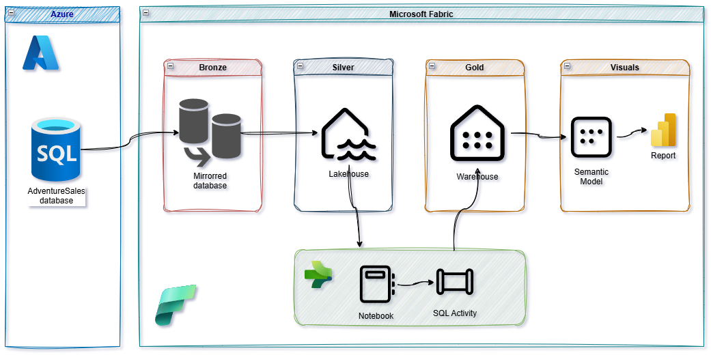

# Microsoft Fabric solution overview

This demo presents an end-to-end analytics solution for an AdventureSales (LT) e-commerce scenario built on Microsoft Fabric, following the medallion architecture.

Prerequisite: the original AdventureWorks LT schema is not directly compatible with Fabric mirroring, so a set of schema and data adjustments are applied first (bronze) to enable a smooth mirroring and downstream modeling experience.

## Diagrams

Architecture overview

End-to-end data flow

## Architecture

- Bronze (Mirrored Database)
  - Source: AdventureWorks LT (a transactional SQL database).
  - Preparation: Run scripts from `bronze/AdventureSales` to adjust data types (e.g., bit-based UDTs → tinyint; NVARCHAR-based UDTs → NVARCHAR system types) and fix sample dates.
  - Mirroring: Configure Fabric Mirrored Database against the prepared source.

- Silver (Lakehouse)
  - Create a Fabric Lakehouse.
  - Add shortcuts to mirrored tables.
  - Create Materialized Lake Views (MLVs) that project the data into a schema tailored for dimensional modeling and analytics.

- Gold (Warehouse)
  - Create a Fabric Warehouse.
  - Deploy schemas and tables from `gold/dim` and `gold/fact`.
  - Use `gold/etl` stored procedures to load and maintain dimensions and facts (simple watermarking and error logging are included).

## Components in this repository

- `bronze/AdventureSales`: preparation SQL scripts for schema/data adjustments.
- `silver`: notebooks to create and refresh the MLVs.
- `gold`: DDL and ETL T-SQL for dimensional model in a Fabric Warehouse.

## Reproducing the solution (step-by-step)

1) Prepare the source database
   - Restore or create AdventureWorks LT (or AdventureSales LT) in SQL Server or Azure SQL.
   - Execute the scripts in `bronze/AdventureSales` to align data types and demo dates:
     - Convert bit types and related UDTs to tinyint where needed.
  - Replace NVARCHAR-based UDTs with NVARCHAR system types (preserve Unicode; UDTs are unsupported by Fabric mirroring).
     - Adjust order dates to create realistic time-series patterns.

2) Create a Mirrored Database in Fabric (Bronze)
   - In your Fabric workspace, set up Mirroring for the prepared source database.
   - Validate that mirrored tables reflect the adjusted schema.

3) Build the Lakehouse (Silver)
   - Create a Lakehouse.
   - Add table shortcuts to the mirrored tables.
   - Open and run `silver/create_mlvs.ipynb` to define MLVs.
   - Use `silver/refresh_mlvs.ipynb` to refresh and validate that the silver dataset materializes as expected.

4) Build the Warehouse (Gold)
   - Create a Warehouse.
   - Run `gold/dim/dim.sql` and `gold/fact/fact.sql` to create schemas.
   - Deploy DDL in `gold/dim/Tables` and `gold/fact/Tables` to create dimension and fact tables.
   - Create supporting ETL tables: `gold/etl/Tables/watermark.sql` and `gold/etl/Tables/error_log.sql`.
   - Execute stored procedures in `gold/etl/StoredProcedures` to load dimensions and facts.
   - Alternatively, import the Warehouse Database project directly into Fabric as a Warehouse.

## Notes and recommendations

- These scripts and notebooks are for demo/education. Review before applying to production datasets.
- Use a separate Fabric workspace for experimentation.